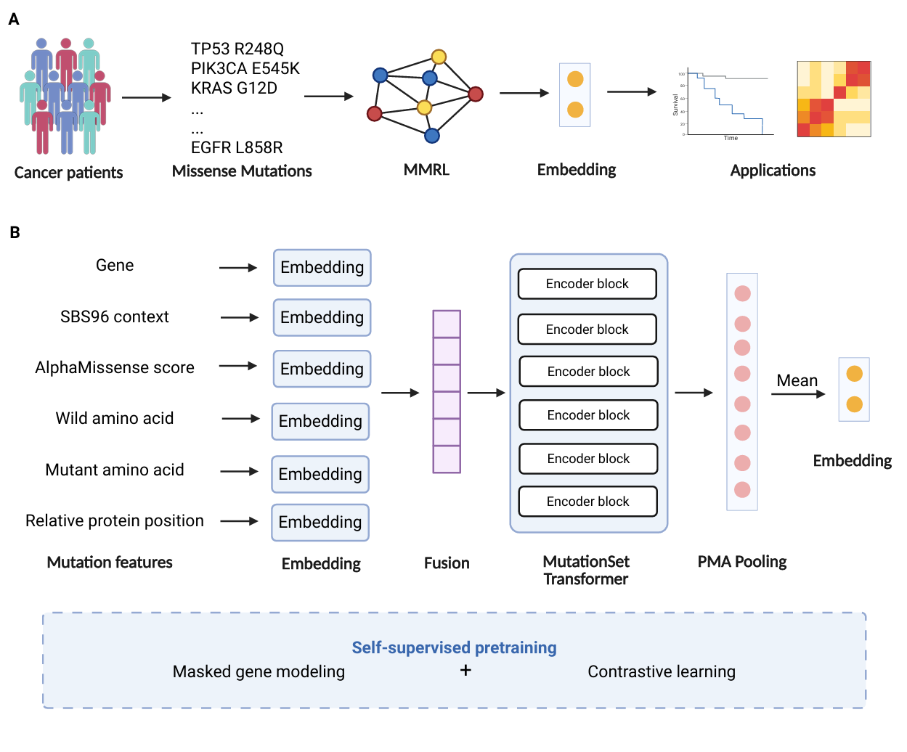

# Missense Mutation Embedding Extraction

Extract tumor sample missense mutation embeddings using a pretrained `MMRL`.



## Installation

Clone the repository:

```bash
git clone https://github.com/charlin90/MMRL.git
cd MMRL
```

Install dependencies:

```bash
pip install numpy pandas torch scikit-learn joblib tqdm
```

Make sure the checkpoint directory contains:

```text
checkpoints/
├── best_model.pth
├── gene_encoder.pkl
└── mut_type_encoder.pkl
```

## Input File

The input file should be a tab-separated TSV file with the following columns:

```text
Hugo_Symbol
SBS96
am_pathogenicity
Tumor_Sample_Barcode
AAchange
Relative_Position
```

Example:

```text
Hugo_Symbol	SBS96	am_pathogenicity	Tumor_Sample_Barcode	AAchange	Relative_Position
TP53	A[T>C]A	0.98	sample_001	R>H	0.42
KRAS	G[C>T]G	0.91	sample_001	G>D	0.18
PIK3CA	A[T>G]G	0.87	sample_002	H>R	0.63
```

Mutations are grouped by `Tumor_Sample_Barcode` to generate one embedding for each sample.

## Usage

Run:

```bash
python extract_embeddings.py \
    --input_file data/mutations.tsv \
    --checkpoint_dir ./checkpoints \
    --output_file ./outputs/sample_embeddings.npy \
    --output_pids ./outputs/sample_ids.tsv
```

For a specific device:

```bash
python extract_embeddings.py \
    --input_file data/mutations.tsv \
    --checkpoint_dir ./checkpoints \
    --output_file ./outputs/sample_embeddings.npy \
    --output_pids ./outputs/sample_ids.tsv \
    --device npu:0
```

You can also use:

```bash
--device cpu
```

or:

```bash
--device cuda:0
```

Optional arguments:

```text
--batch_size     Inference batch size (default: 256)
--num_workers    Number of DataLoader workers (default: 16)
```

The script outputs:

```text
sample_embeddings.npy    # sample-level embeddings
sample_ids.tsv           # corresponding sample IDs
```
